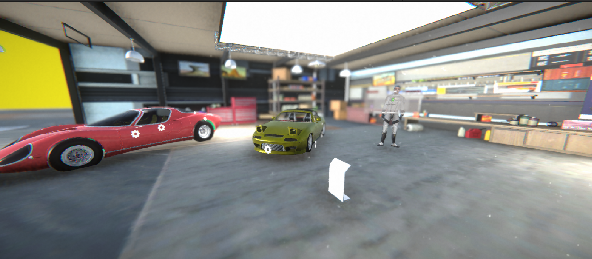
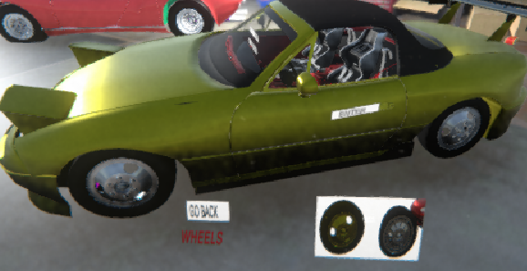
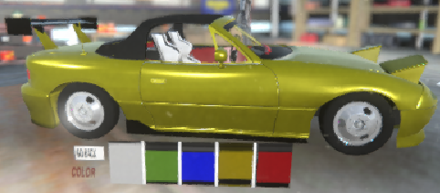
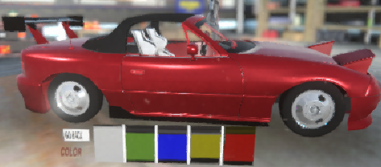
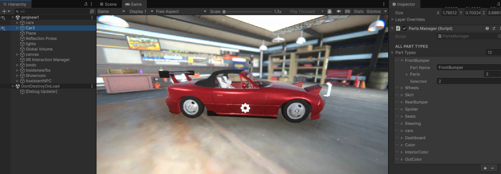

# 🚗 VR Car Customization & Design Studio

<p align="center">
  
</p>

<p align="center">


</p>

---

# 🌟 Overview

VR Car Customization & Design Studio is an immersive Virtual Reality application developed using **Unity**, **C#**, **XR Interaction Toolkit**, and **Universal Render Pipeline (URP)**.

The application allows users to customize a life-sized vehicle inside a fully interactive VR showroom. Users can change the body color, wheels, bumpers, side skirts, and interior components in real time before entering a virtual driving environment to experience their customized vehicle.

The project was built for **Meta Quest 2** and focuses on delivering realistic graphics, smooth interaction, optimized performance, and an intuitive VR experience.

---

# 🎥 Demo Video

> 📺 Watch the complete project demonstration.

**YouTube**

https://youtu.be/YOUR_VIDEO_LINK

---

# 🌐 Live Demo

> Experience the project online.

https://YOUR-LIVE-DEMO-LINK.com

*(If there is no live demo, replace this with "Coming Soon".)*

---

# 📂 Google Drive

Project Files

https://drive.google.com/drive/folders/YOUR_GOOGLE_DRIVE_LINK

Contents include:

- 📄 Project Report
- 🎥 Project Video
- 📱 APK Build
- 💻 Unity Project
- 📊 Presentation
- 📷 Screenshots

---

# ✨ Features

- 🎨 Real-Time Car Color Customization
- 🛞 Alloy Wheel Selection
- 🚘 Front & Rear Bumper Customization
- 🪑 Interior Customization
- 🚗 Side Skirt Selection
- 🚙 Virtual Test Drive
- 🎮 VR Controller Interaction
- 📡 Raycast UI System
- 💾 Save & Load Configurations
- 🌍 Immersive VR Showroom
- ⚡ Optimized for Meta Quest 2
- 🎵 Engine Audio System
- 🚀 High Performance Rendering

---

# 📸 Screenshots

## 🏠 VR Showroom

<p align="center">

</p>

Experience a realistic virtual showroom where users can inspect the vehicle from every angle.

---

## 🛞 Wheel Customization

<p align="center">

</p>

Swap between multiple alloy wheel designs instantly.

---

## 🎨 Color Customization

<p align="center">

</p>

Apply different paint colors in real time using PBR materials.

---

## 🚗 Customized Vehicle

<p align="center">

</p>

Preview the fully customized vehicle before entering the driving scene.

---

## ⚙ Unity Development

<p align="center">

</p>

Built using Unity 2022 LTS with XR Interaction Toolkit and Universal Render Pipeline.

---

# 🛠 Technology Stack

| Technology | Usage |
|------------|-------|
| Unity 2022 LTS | Game Engine |
| C# | Programming |
| XR Interaction Toolkit | VR Interaction |
| Universal Render Pipeline | Rendering |
| Blender | 3D Modeling |
| Meta Quest 2 | VR Hardware |
| Visual Studio | Development |
| Git & GitHub | Version Control |

---

# 🏗 Project Architecture

```
VR Car Customization
│
├── VR Showroom
│
├── XR Interaction
│
├── UI Manager
│
├── Car Customization Manager
│
├── Material Manager
│
├── Mesh Swapping
│
├── Vehicle Controller
│
├── Save System
│
├── VR Driving System
│
└── Rendering Pipeline
```

---

# 🎮 VR Controls

| Action | Control |
|---------|----------|
| Teleport | Thumbstick |
| Select | Trigger |
| Grab | Grip |
| Open Menu | Trigger |
| Steering | Left Stick |
| Accelerate | Right Stick |
| Brake | Right Stick Back |

---

# 📊 Performance

| Metric | Result |
|---------|---------|
| Average FPS | 72+ FPS |
| Interaction Delay | <80 ms |
| Color Change | Instant |
| Component Swap | <200 ms |
| Navigation Accuracy | 94% |
| VR Stability | Excellent |

---

# 📁 Project Structure

```
VR-Car-Customization-Studio
│
├── Assets
├── Packages
├── ProjectSettings
├── Screenshots
│   ├── image4.png
│   ├── image5.png
│   ├── image6.png
│   ├── image7.png
│   └── image8.png
├── README.md
└── LICENSE
```

---

# 🚀 Getting Started

Clone the repository

```bash
git clone https://github.com/YOUR_USERNAME/VR-Car-Customization-Studio.git
```

Open using

```
Unity 2022.3 LTS
```

Install required packages:

- XR Interaction Toolkit
- Input System
- Universal RP
- Oculus XR Plugin

Build Platform

```
Android
```

Target Device

```
Meta Quest 2
```

---

# 📈 Future Improvements

- 🤖 AI Voice Assistant
- ☁ Cloud Save
- 👥 Multiplayer Showroom
- 🚘 More Vehicle Models
- 🌐 Online Garage
- 📱 Mobile Companion App
- 🛒 Vehicle Marketplace
- 🎤 Voice Commands
- 📷 Photo Mode

---

# 👨‍💻 Team

- **Joshua Greg Colaco**
- **Aloysia Marylane D'Souza**
- **Clyde Nellio Furtado**
- **Enosh Rapose**

### Project Guide

**Mrs. Raksha Singbal**

Department of Electronics & Computer Engineering

Padre Conceicao College of Engineering

---

# ⭐ Support

If you found this project helpful:

⭐ Star this repository

🍴 Fork the repository

🐞 Report issues

💡 Suggest new features

---

# 📄 License

This project was developed for academic and educational purposes.

Licensed under the MIT License.
